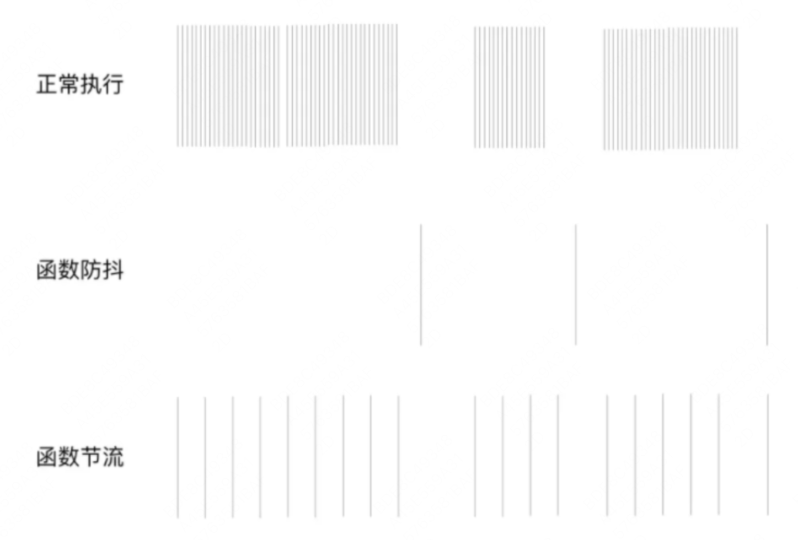
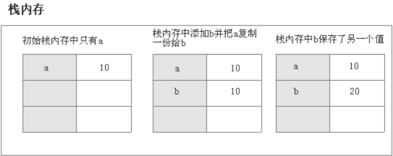
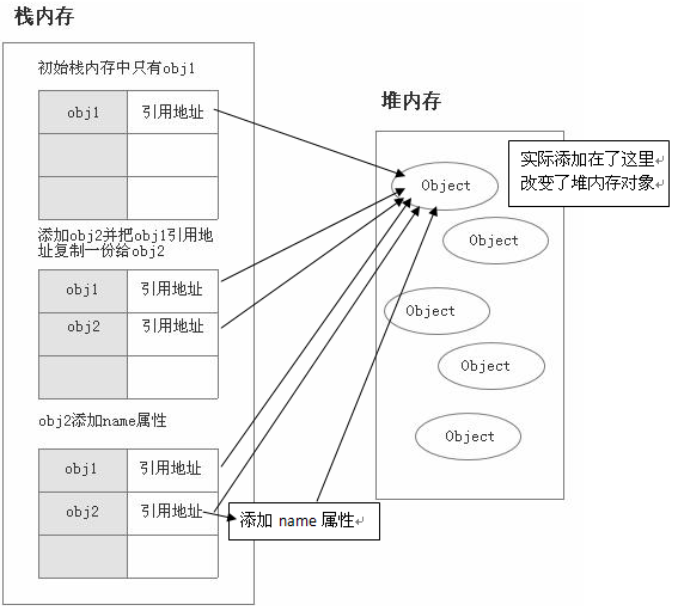

### 目录
- [1. 浏览器安全](#1浏览器安全)
- [2. 模块化规范](#2模块化规范)
- [3. 跨域](#3跨域)
- [4. call、bind和apply](#4callbind和apply)
- [5. 垃圾回收](#5javascript-中的垃圾回收)
- [6. 防抖和节流](#6js-的防抖和节流)
- [7. 事件循环](#7js-的事件循环)
- [8. 浅拷贝和深拷贝](#8-浅拷贝和深拷贝)
- [9. 数据结构](#9-数据结构)
- [10. 原型和原型链](#10-原型和原型链)

<br>

## 1、浏览器安全
### 1.1 XSS
Cross-Site Scripting（跨站脚本攻击）简称 XSS，是一种代码注入攻击。攻击者通过在目标网站上注入恶意脚本，使之在用户的浏览器上运行。利用这些恶意脚本，攻击者可获取用户的敏感信息如 Cookie、SessionID 等，进而危害数据安全。(为了和 CSS 区分，这里把攻击的第一个字母改成了 X，于是叫做 XSS。)。详见[什么是 XSS 攻击？如何防范 XSS 攻击？](https://juejin.cn/post/6844903685122703367)

XSS 的本质是因为网站没有对恶意代码进行过滤，与正常的代码混合在一起了，浏览器没有办法分辨哪些脚本是可信的，从而导致了恶意代码的执行。

XSS 一般分为存储型、反射型和 DOM 型。

- 存储型指的是恶意代码提交到了网站的数据库中，当用户请求数据的时候，服务器将其拼接为 HTML 后返回给了用户，从而导致了恶意代码的执行。
- 反射型指的是攻击者构建了特殊的 URL，当服务器接收到请求后，从 URL 中获取数据，拼接到 HTML 后返回，从而导致了恶意代码的执行。
- DOM 型指的是攻击者构建了特殊的 URL，用户打开网站后，js 脚本从 URL 中获取数据，从而导致了恶意代码的执行。

XSS 攻击的预防可以从两个方面入手，一个是恶意代码提交的时候，一个是浏览器执行恶意代码的时候。

- 一种是使用纯前端的方式，不用服务器端拼接后返回。
- 另一种是对需要插入到 HTML 中的代码做好充分的转义。
- 对于 DOM 型的攻击，主要是前端脚本的不可靠而造成的，我们对于数据获取渲染和字符串拼接的时候应该对可能出现的恶意代码情况进行判断。
- 还有一些方式，比如使用 CSP(Content-Security-Policy) ，CSP 的本质是建立一个白名单，告诉浏览器哪些外部资源可以加载和执行，从而防止恶意代码的注入攻击。详见：[什么是 CSP？](https://www.ruanyifeng.com/blog/2016/09/csp.html)
- 还可以对一些敏感信息进行保护，比如 cookie 使用 http-only ，使得脚本无法获取（document.cookie），只能服务器修改。也可以使用验证码，避免脚本伪装成用户执行一些操作。详见：[浅谈Js 操作Cookie，以及HttpOnly 的限制](https://zhuanlan.zhihu.com/p/36197012)

<br>

### 1.2 CSRF
CSRF 攻击指的是跨站请求伪造攻击，攻击者诱导用户进入一个第三方网站，然后该网站向被攻击网站发送跨站请求。如果用户在被
攻击网站中保存了登录状态，那么攻击者就可以利用这个登录状态，绕过后台的用户验证，冒充用户向服务器执行一些操作。

CSRF 攻击的本质是利用了 cookie 会在同源请求中携带发送给服务器的特点，以此来实现用户的冒充。

一般的 CSRF 攻击类型有三种：

第一种是 GET 类型的 CSRF 攻击，比如在网站中的一个 img 标签里构建一个请求，当用户打开这个网站的时候就会自动发起提
交。

第二种是 POST 类型的 CSRF 攻击，比如说构建一个表单，然后隐藏它，当用户进入页面时，自动提交这个表单。

第三种是链接类型的 CSRF 攻击，比如说在 a 标签的 href 属性里构建一个请求，然后诱导用户去点击。

CSRF 可以用下面几种方法来防护：

第一种是同源检测的方法，服务器根据 http 请求头中 origin 或者 referer 信息来判断请求是否为允许访问的站点，从而对请求进行过滤。当 origin 或者 referer 信息都不存在的时候，直接阻止。这种方式的缺点是有些情况下 referer 可以被伪造。还有就是我们这种方法同时把搜索引擎的链接也给屏蔽了，所以一般网站会允许搜索引擎的页面请求，但是相应的页面请求这种请求方式也可能被攻击者给利用。

第二种方法是使用 CSRF Token 来进行验证，服务器向用户返回一个随机数 Token ，当网站再次发起请求时，在请求参数中加入服务器端返回的 token ，然后服务器对这个 token 进行验证。这种方法解决了使用 cookie 单一验证方式时，可能会被冒用的问题，但是这种方法存在一个缺点就是，我们需要给网站中的所有请求都添加上这个 token，操作比较繁琐。还有一个问题是一般不会只有一台网站服务器，如果我们的请求经过负载平衡转移到了其他的服务器，但是这个服务器的 session 中没有保留这个 token 的话，就没有办法验证了。这种情况我们可以通过改变 token 的构建方式来解决。

第三种方式使用双重 Cookie 验证的办法，服务器在用户访问网站页面时，向请求域名注入一个Cookie，内容为随机字符串，然后当用户再次向服务器发送请求的时候，从 cookie 中取出这个字符串，添加到 URL 参数中，然后服务器通过对 cookie 中的数据和参数中的数据进行比较，来进行验证。使用这种方式是利用了攻击者只能利用 cookie，但是不能访问获取 cookie 的特点。并且这种方法比 CSRF Token 的方法更加方便，并且不涉及到分布式访问的问题。这种方法的缺点是如果网站存在 XSS 漏洞的，那么这种方式会失效。同时这种方式不能做到子域名的隔离。

第四种方式是使用在设置 cookie 属性的时候设置 Samesite ，限制 cookie 不能作为被第三方（跨域）使用，从而可以避免被攻击者利用。Samesite 一共有两种模式，一种是严格模式，在严格模式下 cookie 在任何情况下都不可能作为第三方 Cookie 使用，在宽松模式Lax下，cookie 可以被请求是 GET 请求，且会发生页面跳转的请求所使用。详见[Samesite](https://github.com/CavsZhouyou/Front-End-Interview-Notebook/blob/master/JavaScript/JavaScript.md#105-%E4%BB%80%E4%B9%88%E6%98%AF-samesite-cookie-%E5%B1%9E%E6%80%A7)

详见：[如何防止CSRF攻击？](https://tech.meituan.com/2018/10/11/fe-security-csrf.html)

<br>

### 1.3 点击劫持
- [什么是点击劫持？如何防范点击劫持？](https://www.jianshu.com/p/251704d8ff18)

<br>

## 2、模块化规范
- [js 的几种模块规范](https://github.com/CavsZhouyou/Front-End-Interview-Notebook/edit/master/JavaScript/JavaScript.md#65-amd-%E5%92%8C-cmd-%E8%A7%84%E8%8C%83%E7%9A%84%E5%8C%BA%E5%88%AB)
- [ES6 模块与 CommonJS 模块、AMD、CMD 的差异](https://github.com/CavsZhouyou/Front-End-Interview-Notebook/edit/master/JavaScript/JavaScript.md#66-es6-%E6%A8%A1%E5%9D%97%E4%B8%8E-commonjs-%E6%A8%A1%E5%9D%97amdcmd-%E7%9A%84%E5%B7%AE%E5%BC%82)
- [AMD 和 CMD 规范的区别](https://github.com/CavsZhouyou/Front-End-Interview-Notebook/blob/master/JavaScript/JavaScript.md#60-%E5%A6%82%E4%BD%95%E8%A7%A3%E5%86%B3%E8%B7%A8%E5%9F%9F%E9%97%AE%E9%A2%98)
- [前端模块化：CommonJS,AMD,CMD,ES6](https://juejin.cn/post/6844903576309858318)

<br>

## 3、跨域
### 3.1 什么是浏览器的同源政策？
我对浏览器的同源政策的理解是，一个域下的 js 脚本在未经允许的情况下，不能够访问另一个域的内容。这里的同源的指的是两个域的协议、域名、端口号必须相同，否则则不属于同一个域。

同源政策主要限制了三个方面：
- 第一个是当前域下的 js 脚本不能够访问其他域下的 cookie、localStorage 和 indexDB。
- 第二个是当前域下的 js 脚本不能够操作访问操作其他域下的 DOM。
- 第三个是当前域下 ajax 无法发送跨域请求。

同源政策的目的主要是为了保证用户的信息安全，它只是对 js 脚本的一种限制，并不是对浏览器的限制，对于一般的 img、或者script 脚本请求都不会有跨域的限制，这是因为这些操作都不会通过响应结果来进行可能出现安全问题的操作。详见：[什么是浏览器的同源政策](https://github.com/CavsZhouyou/Front-End-Interview-Notebook/blob/master/JavaScript/JavaScript.md#59-%E4%BB%80%E4%B9%88%E6%98%AF%E6%B5%8F%E8%A7%88%E5%99%A8%E7%9A%84%E5%90%8C%E6%BA%90%E6%94%BF%E7%AD%96)

### 3.2 如何解决跨域问题？
#### 3.2.1 jsonp
jsonp 原理： 动态的添加了一个script标签，src指向跨域的一个跨域脚本，并且将上面的js函数名作为callback参数传入。服务端不再返回JSON格式的数据，而是返回了一段将JSON数据作为传入参数的callback函数执行代码。

#### 3.2.2 跨域方式概述
- 使用 jsonp 来实现跨域请求，它的主要原理是通过动态构建 script  标签来实现跨域请求，因为浏览器对 script 标签的引入没有跨域的访问限制 。通过在请求的 url 后指定一个回调函数，然后服务器在返回数据的时候，构建一个 json 数据的包装，这个包装就是回调函数，然后返回给前端，前端接收到数据后，因为请求的是脚本文件，所以会直接执行，这样我们先前定义好的回调函数就可以被调用，从而实现了跨域请求的处理。这种方式只能用于 get 请求。
- 使用 CORS 的方式，CORS 是一个 W3C 标准，全称是"跨域资源共享"。CORS 需要浏览器和服务器同时支持。目前，所有浏览器都支持该功能，因此我们只需要在服务器端配置就行。浏览器将 CORS 请求分成两类：简单请求和非简单请求。对于简单请求，浏览器直接发出 CORS 请求。具体来说，就是会在头信息之中，增加一个 Origin 字段。Origin 字段用来说明本次请求来自哪个源。服务器根据这个值，决定是否同意这次请求。对于如果 Origin 指定的源，不在许可范围内，服务器会返回一个正常的 HTTP 回应。浏览器发现，这个回应的头信息没有包含 Access-Control-Allow-Origin 字段，就知道出错了，从而抛出一个错误，ajax 不会收到响应信息。如果成功的话会包含一些以 Access-Control- 开头的字段。非简单请求，浏览器会先发出一次预检请求，来判断该域名是否在服务器的白名单中，如果收到肯定回复后才会发起请求。

- 使用服务器来代理跨域的访问请求，就是有跨域的请求操作时发送请求给后端，让后端代为请求，然后最后将获取的结果发返回。
首先我们如果只是想要实现主域名下的不同子域名的跨域操作，我们可以使用设置 document.domain 来解决。

- 使用 websocket 协议，这个协议没有同源限制。

- 将 document.domain 设置为主域名，来实现相同子域名的跨域操作，这个时候主域名下的 cookie 就能够被子域名所访问。同时如果文档中含有主域名相同，子域名不同的 iframe 的话，我们也可以对这个 iframe 进行操作。

如果是想要解决不同跨域窗口间的通信问题，比如说一个页面想要和页面的中的不同源的 iframe 进行通信的问题，我们可以使用 location.hash 或者 window.name 或者 postMessage 来解决。

- 使用 location.hash 的方法，我们可以在主页面动态的修改 iframe 窗口的 hash 值，然后在 iframe 窗口里实现监听函数来实现这样一个单向的通信。因为在 iframe 是没有办法访问到不同源的父级窗口的，所以我们不能直接修改父级窗口的 hash 值来实现通信，我们可以在 iframe 中再加入一个 iframe ，这个 iframe 的内容是和父级页面同源的，所以我们可以 window.parent.parent 来修改最顶级页面的 src，以此来实现双向通信。

- 使用 window.name 的方法，主要是基于同一个窗口中设置了 window.name 后不同源的页面也可以访问，所以不同源的子页面可以首先在 window.name 中写入数据，然后跳转到一个和父级同源的页面。这个时候父级页面就可以访问同源的子页面中 window.name 中的数据了，这种方式的好处是可以传输的数据量大。

- 使用 postMessage 来解决的方法，这是一个 h5 中新增的一个 api。通过它我们可以实现多窗口间的信息传递，通过获取到指定窗口的引用，然后调用 postMessage 来发送信息，在窗口中我们通过对 message 信息的监听来接收信息，以此来实现不同源间的信息交换。

跨域详见：[跨域，你需要知道的全在这里](https://juejin.cn/post/6844903508689321991)

<br>

## 4、call、bind和apply
### 4.1 区别
- apply: apply接受两个参数，第一个参数是this的指向，第二个参数是函数接受的参数，以数组的形式传入，且当第一个参数为null、undefined的时候，默认指向window(在浏览器中)，使用apply方法改变this指向后原函数会立即执行
- call: call方法的第一个参数也是this的指向，后面传入的是一个参数列表（注意和apply传参的区别）。当一个参数为null或undefined的时候，表示指向window（在浏览器中），和apply一样，call也只是临时改变一次this指向，并立即执行
- bind: bind方法和call很相似，第一参数也是this的指向，后面传入的也是一个参数列表(但是这个参数列表可以分多次传入，call则必须一次性传入所有参数)，但是它改变this指向后不会立即执行，而是返回一个永久改变this指向的函数

详见：[区别](https://zhuanlan.zhihu.com/p/82340026)

### 4.2 手写
```js
// call函数实现
Function.prototype.myCall = function(context) {
  // 判断调用对象
  if (typeof this !== "function") {
    console.error("type error");
  }

  // 获取参数
  let args = [...arguments].slice(1),
    result = null;

  // 判断 context 是否传入，如果未传入则设置为 window
  context = context || window;

  // 将调用函数设为对象的方法
  context.fn = this;

  // 调用函数
  result = context.fn(...args);

  // 将属性删除
  delete context.fn;

  return result;
};
```

```js
// apply 函数实现
Function.prototype.myApply = function(context) {
  // 判断调用对象是否为函数
  if (typeof this !== "function") {
    throw new TypeError("Error");
  }

  let result = null;

  // 判断 context 是否存在，如果未传入则为 window
  context = context || window;

  // 将函数设为对象的方法
  context.fn = this;

  // 调用方法
  if (arguments[1]) {
    result = context.fn(...arguments[1]);
  } else {
    result = context.fn();
  }

  // 将属性删除
  delete context.fn;

  return result;
};
```

```js
// bind 函数实现
Function.prototype.bind = function(context) {
  //返回一个绑定this的函数，我们需要在此保存this
  let self = this
      // 可以支持柯里化传参，保存参数
  let arg = [...arguments].slice(1)
      // 返回一个函数
  return function() {
    //同样因为支持柯里化形式传参我们需要再次获取存储参数
    let newArg = [...arguments]
        // 返回函数绑定this，传入两次保存的参数
        //考虑返回函数有返回值做了return
    return self.apply(context, arg.concat(newArg))
  }
}
```
<br>


## 5、JavaScript 中的垃圾回收
### 5.1 简单介绍一下 V8 引擎的垃圾回收机制
```
V8的垃圾回收策略基于分代回收机制，该机制又基于 世代假说。该假说有两个特点：大部分新生对象倾向于早死；
不死的对象，会活得更久。基于这个理论，现代垃圾回收算法根据对象的存活时间将内存进行了分代，并对不同分代的内存采用不同的高效算法进行垃圾回收。

v8 的垃圾回收机制基于分代回收机制，这个机制又基于世代假说，这个假说有两个特点，一是新生的对象容易早死，另一个是不死的对象会活得更久。基于这个假说，v8 引擎将内存分为了新生代和老生代。

新创建的对象或者只经历过一次的垃圾回收的对象被称为新生代。经历过多次垃圾回收的对象被称为老生代。

新生代被分为 From 和 To 两个空间，To 一般是闲置的。当 From 空间满了的时候会执行 Scavenge 算法进行垃圾回收。当我们执行垃圾回收算法的时候应用逻辑将会停止，等垃圾回收结束后再继续执行。这个算法分为三步：

（1）首先检查 From 空间的存活对象，如果对象存活则判断对象是否满足晋升到老生代的条件，如果满足条件则晋升到老生代。如果不满足条件则移动 To 空间。

（2）如果对象不存活，则释放对象的空间。

（3）最后将 From 空间和 To 空间角色进行交换。

新生代对象晋升到老生代有两个条件：

（1）第一个是判断是对象否已经经过一次 Scavenge 回收。若经历过，则将对象从 From 空间复制到老生代中；若没有经历，则复制到 To 空间。

（2）第二个是 To 空间的内存使用占比是否超过限制。当对象从 From 空间复制到 To 空间时，若 To 空间使用超过 25%，则对象直接晋升到老生代中。设置 25% 的原因主要是因为算法结束后，两个空间结束后会交换位置，如果 To 空间的内存太小，会影响后续的内存分配。

老生代采用了标记清除法和标记压缩法。标记清除法首先会对内存中存活的对象进行标记，标记结束后清除掉那些没有标记的对象。由于标记清除后会造成很多的内存碎片，不便于后面的内存分配。所以了解决内存碎片的问题引入了标记压缩法。

由于在进行垃圾回收的时候会暂停应用的逻辑，对于新生代方法由于内存小，每次停顿的时间不会太长，但对于老生代来说每次垃圾回收的时间长，停顿会造成很大的影响。 为了解决这个问题 V8 引入了增量标记的方法，将一次停顿进行的过程分为了多步，每次执行完一小步就让运行逻辑执行一会，就这样交替运行。
```
详见：[深入理解V8的垃圾回收原理](https://www.jianshu.com/p/b8ed21e8a4fb)、[JavaScript 中的垃圾回收](https://zhuanlan.zhihu.com/p/23992332)

<br>

### 5.2 哪些操作会造成内存泄漏？
不再用到的内存，没有及时释放，就叫做内存泄漏（memory leak）。
```
第一种情况是我们由于使用未声明的变量，而意外的创建了一个全局变量，而使这个变量一直留在内存中无法被回收。

第二种情况是我们设置了 setInterval 定时器，而忘记取消它，如果循环函数有对外部变量的引用的话，那么这个变量会被一直留
在内存中，而无法被回收。

第三种情况是我们获取一个 DOM 元素的引用，而后面这个元素被删除，由于我们一直保留了对这个元素的引用，所以它也无法被回
收。

第四种情况是不合理的使用闭包，从而导致某些变量一直被留在内存当中。
```
详见： [JavaScript 内存泄漏教程](https://www.ruanyifeng.com/blog/2017/04/memory-leak.html)、 [4类 JavaScript 内存泄漏及如何避免](https://jinlong.github.io/2016/05/01/4-Types-of-Memory-Leaks-in-JavaScript-and-How-to-Get-Rid-Of-Them/)

<br>

## 6、js 的防抖和节流
### 6.1 概念
- 节流: n 秒内只运行一次，若在 n 秒内重复触发，只有一次生效
- 防抖: n 秒后在执行该事件，若在 n 秒内被重复触发，则重新计时


### 6.2 实现
防抖
```js
function debounce(func, wait) {
    let timeout;

    return function () {
        let context = this; // 保存this指向
        let args = arguments; // 拿到event对象

        clearTimeout(timeout)
        timeout = setTimeout(function(){
            func.apply(context, args)
        }, wait);
    }
}
```

节流
```js
function throttled2(fn, delay = 500) {
  let timer = null
  return function (...args) {
    if (!timer) {
      timer = setTimeout(() => {
        fn.apply(this, args)
        timer = null
      }, delay);
    }
  }
}
```

### 6.3 应用场景
防抖在连续的事件，只需触发一次回调的场景有：
- 搜索框搜索输入。只需用户最后一次输入完，再发送请求
- 手机号、邮箱验证输入检测
- 窗口大小resize。只需窗口调整完成后，计算窗口大小。防止重复渲染。

节流在间隔一段时间执行一次回调的场景有：
- 滚动加载，加载更多或滚到底部监听
- 搜索框，搜索联想功能

详见: [什么是防抖和节流](https://vue3js.cn/interview/JavaScript/debounce_throttle.html#%E9%9D%A2%E8%AF%95%E5%AE%98-%E4%BB%80%E4%B9%88%E6%98%AF%E9%98%B2%E6%8A%96%E5%92%8C%E8%8A%82%E6%B5%81-%E6%9C%89%E4%BB%80%E4%B9%88%E5%8C%BA%E5%88%AB-%E5%A6%82%E4%BD%95%E5%AE%9E%E7%8E%B0)

<br>

## 7、js 的事件循环
### 7.1 定义
因为 js 是单线程运行的，在代码执行的时候，通过将不同函数的执行上下文压入执行栈中来保证代码的有序执行。同步任务进入主线程，即主执行栈，异步任务进入任务队列，主线程内的任务执行完毕为空，会去任务队列读取对应的任务，推入主线程执行。任务队列可以分为宏任务对列和微任务对列，当当前执行栈中的事件执行完毕后，js 引擎首先会判断微任务对列中是否有任务可以执行，如果有就将微任务队首的事件压入栈中执行。当微任务对列中的任务都执行完成后再去判断宏任务对列中的任务。

### 7.2 微任务和宏任务
- 微任务是一个需要异步执行的函数，执行时机是在主函数执行结束之后、当前宏任务结束之前。包括了 promise 的回调、node 中的 process.nextTick 、对 Dom 变化监听的 MutationObserver。
- 宏任务的时间粒度比较大，执行的时间间隔是不能精确控制的，对一些高实时性的需求就不太符合。包括了 script 脚本的执行、setTimeout ，setInterval ，setImmediate 一类的定时事件，还有如 I/O 操作、UI 渲染等。

详见：[对事件循环的理解](https://vue3js.cn/interview/JavaScript/event_loop.html)
<br>

## 8、 浅拷贝和深拷贝
### 8.1 概念
- 浅拷贝指的是将一个对象的属性值复制到另一个对象，如果有的属性的值为引用类型的话，那么会将这个引用的地址复制给对象，因此两个对象会有同一个引用类型的引用
- 深拷贝相对浅拷贝而言，如果遇到属性值为引用类型的时候，它新建一个引用类型并将对应的值复制给它，因此对象获得的一个新的引用类型而不是一个原有类型的引用。

### 8.2 实现
```js
// 浅拷贝的实现;
function shallowCopy(object) {
  // 只拷贝对象
  if (!object || typeof object !== "object") return;

  // 根据 object 的类型判断是新建一个数组还是对象
  let newObject = Array.isArray(object) ? [] : {};

  // 遍历 object，并且判断是 object 的属性才拷贝
  for (let key in object) {
    if (object.hasOwnProperty(key)) {
      newObject[key] = object[key];
    }
  }

  return newObject;
}

// 深拷贝的实现;
function deepCopy(object) {
  if (!object || typeof object !== "object") return object;

  let newObject = Array.isArray(object) ? [] : {};

  for (let key in object) {
    if (object.hasOwnProperty(key)) {
      newObject[key] = deepCopy(object[key]);
    }
  }

  return newObject;
}
```

### 8.3 常见方式
- 浅拷贝：Object.assign、Array.prototype.slice(), Array.prototype.concat()、[...arr]
- 深拷贝：_.cloneDeep()、JSON.parse(JSON.stringify())

详见：[深浅拷贝](https://vue3js.cn/interview/JavaScript/copy.html)

<br>

## 9. 数据结构
### 9.1 数据类型
#### 9.1.1 基本和引用数据类型
js 一共有五种基本数据类型，分别是 Undefined、Null、Boolean、Number、String，还有在 ES6 中新增的 Symbol 和 ES10 中新增的 BigInt 类型。

Symbol 代表创建后独一无二且不可变的数据类型，它的出现我认为主要是为了解决可能出现的全局变量冲突的问题。

BigInt 是一种数字类型的数据，它可以表示任意精度格式的整数，使用 BigInt 可以安全地存储和操作大整数，即使这个数已经超出了 Number 能够表示的安全整数范围。

引用类型：Array、Function、Object

#### 9.1.2 存储区别
基本数据类型存储在栈中，引用类型的对象存储于堆中





### 9.2 Symbol 类型的注意点？
- Symbol 函数前不能使用 new 命令，否则会报错。
- Symbol 函数可以接受一个字符串作为参数，表示对 Symbol 实例的描述，主要是为了在控制台显示，或者转为字符串时，比较容易区分。
- Symbol 作为属性名，该属性不会出现在 for...in、for...of 循环中，也不会被 Object.keys()、Object.getOwnPropertyNames()、JSON.stringify() 返回。
- Object.getOwnPropertySymbols 方法返回一个数组，成员是当前对象的所有用作属性名的 Symbol 值。
- Symbol.for 接受一个字符串作为参数，然后搜索有没有以该参数作为名称的 Symbol 值。如果有，就返回这个 Symbol 值，否则就新建并返回一个以该字符串为名称的 Symbol 值。
- Symbol.keyFor 方法返回一个已登记的 Symbol 类型值的 key。

### 9.3 Set 和 WeakSet 结构？
- ES6 提供了新的数据结构 Set。它类似于数组，但是成员的值都是唯一的，没有重复的值。
- WeakSet 结构与 Set 类似，也是不重复的值的集合。但是 WeakSet 的成员只能是对象，而不能是其他类型的值。WeakSet 中的对象都是弱引用，即垃圾回收机制不考虑 WeakSet 对该对象的引用，

### 9.4 Map 和 WeakMap 结构？
- Map 数据结构。它类似于对象，也是键值对的集合，但是“键”的范围不限于字符串，各种类型的值（包括对象）都可以当作键。
- WeakMap 结构与 Map 结构类似，也是用于生成键值对的集合。但是 WeakMap 只接受对象作为键名（ null 除外），不接受其他类型的值作为键名。而且 WeakMap 的键名所指向的对象，不计入垃圾回收机制。

### 9.5 什么是 Proxy ？
Proxy 用于修改某些操作的默认行为，等同于在语言层面做出修改，所以属于一种“元编程”，即对编程语言进行编程。
Proxy 可以理解成，在目标对象之前架设一层“拦截”，外界对该对象的访问，都必须先通过这层拦截，因此提供了一种机制，可以对外界的访问进行过滤和改写。Proxy 这个词的原意是代理，用在这里表示由它来“代理”某些操作，可以译为“代理器”。

### 9.6 Reflect 对象创建目的？
- 将 Object 对象的一些明显属于语言内部的方法（比如 Object.defineProperty，放到 Reflect 对象上。
- 修改某些 Object 方法的返回结果，让其变得更合理。
- 让 Object 操作都变成函数行为。
- Reflect 对象的方法与 Proxy 对象的方法一一对应，只要是 Proxy 对象的方法，就能在 Reflect 对象上找到对应的方法。这就让 Proxy 对象可以方便地调用对应的 Reflect 方法，完成默认行为，作为修改行为的基础。也就是说，不管 Proxy 怎么修改默认行为，你总可以在 Reflect 上获取默认行为。

应用场景：拦截和监视外部对对象的访问，在复杂操作前对操作进行校验或对所需资源进行管理

详见：[ES6中Proxy](https://vue3js.cn/interview/es6/proxy.html#%E9%9D%A2%E8%AF%95%E5%AE%98-%E4%BD%A0%E6%98%AF%E6%80%8E%E4%B9%88%E7%90%86%E8%A7%A3es6%E4%B8%ADproxy%E7%9A%84-%E4%BD%BF%E7%94%A8%E5%9C%BA%E6%99%AF)


## 10. 原型和原型链
### 10.1 定义
在 js 中我们是使用构造函数来新建一个对象的，每一个构造函数的内部都有一个 prototype 属性值，这个属性值是一个对象，这个对象包含了可以由该构造函数的所有实例共享的属性和方法。当我们使用构造函数新建一个对象后，在这个对象的内部将包含一个指针，这个指针指向构造函数的 prototype 属性对应的值，在 ES5 中这个指针被称为对象的原型。

当我们访问一个对象的属性时，如果这个对象内部不存在这个属性，那么它就会去它的原型对象里找这个属性，这个原型对象又会有自己的原型，于是就这样一直找下去，也就是原型链的概念。原型链的尽头一般来说都是 Object.prototype 所以这就是我们新建的对象为什么能够使用 toString() 等方法的原因。

特点：
JavaScript 对象是通过引用来传递的，我们创建的每个新对象实体中并没有一份属于自己的原型副本。当我们修改原型时，与之相关的对象也会继承这一改变。

### 10.2 获取原型的方法
- p.__proto__
- p.constructor.prototype
- Object.getPrototypeOf(p)

详情：[avaScript原型，原型链 ? 有什么特点？](https://vue3js.cn/interview/JavaScript/prototype.html)

<br>


## 11. 闭包
```
闭包是指有权访问另一个函数作用域中变量的函数，创建闭包的最常见的方式就是在一个函数内创建另一个函数，创建的函数可以
访问到当前函数的局部变量。

闭包有两个常用的用途。

闭包的第一个用途是使我们在函数外部能够访问到函数内部的变量。通过使用闭包，我们可以通过在外部调用闭包函数，从而在外
部访问到函数内部的变量，可以使用这种方法来创建私有变量。

函数的另一个用途是使已经运行结束的函数上下文中的变量对象继续留在内存中，因为闭包函数保留了这个变量对象的引用，所以
这个变量对象不会被回收。

其实闭包的本质就是作用域链的一个特殊的应用，只要了解了作用域链的创建过程，就能够理解闭包的实现原理。
```
详见：[什么是闭包，为什么要用它？](http://cavszhouyou.top/JavaScript%E6%B7%B1%E5%85%A5%E7%90%86%E8%A7%A3%E4%B9%8B%E9%97%AD%E5%8C%85.html)